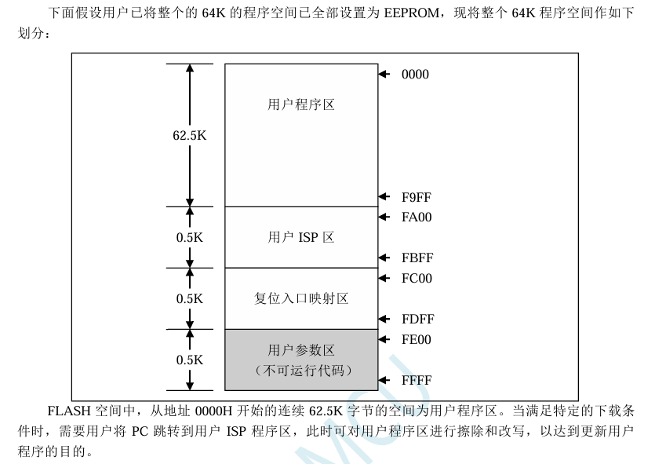

附录L 使用 STC 的 IAP 系列单片机开发自己的

ISP 程序

随着 IAP（In-Application-Programming）技术在单片机领域的不断发展，给应用系统程序代码升级

带来了极大的方便。STC 的串口 ISP（In-System-Programming）程序就是使用 IAP 功能来对用户的程序

进行在线升级的，但是出于对用户代码的安全着想，底层代码和上层应用程序都没有开源，为此 STC 推

出了 IAP 系列单片机，即整颗 MCU 的 Flash 空间，用户均可在自己的程序中进行改写，从而使得有用

户需要开发自己的 ISP 程序的想法得以实现。

STC8G 系列单片机中的所有可以在 ISP 下载时用户自定义 EEPROM 大小的型号均为 IAP 系列单片

机。目前 STC8H 系列有如下型号的单片机为 IAP 系列：STC8G1K12、STC8G1K17、STC8G1K12A、

STC8G1K17A、STC8G1K12-8Pin、STC8G1K17-8Pin、STC8G1K12T、STC8G1K17T、STC8G2K64S2、

STC8G2K64S4。本文以 STC8G2K64S4 为例，详细说明使用 STC 的 IAP 单片机开发用户自己的 ISP 程

序的方法，并给出了基于 Keil 环境的汇编和 C 源码。

第一步：内部 FLASH 规划

由于 STC8G 系列的 IAP 型号单片机的 EEPROM 是在 ISP 下载时用户自己设置的，所以若用户需要

实现自己的 ISP，则在下载用户自己的 ISP 程序时，需要按照下图是方式，将全部的 64K 都设置为

EEPROM，让用户程序空间和 EEPROM 空间完全重合，这样才能实现用户对自己程序空间进行修改和

更新。

下面假设用户已将整个的 64K 的程序空间已全部设置为 EEPROM，现将整个 64K 程序空间作如下

划分：

FLASH 空间中，从地址 0000H 开始的连续 62.5K 字节的空间为用户程序区。当满足特定的下载条

件时，需要用户将 PC 跳转到用户 ISP 程序区，此时可对用户程序区进行擦除和改写，以达到更新用户

程序的目的。

第三步、下位机固件程序说明

下位机固件程序包括两部分：ISP（ISP 代码）和 AP（用户代码）

ISP 代码（汇编代码）

;测试工作频率为 11.0592MHz

UARTBAUD

EQU

0FFE8H

;定义串口波特率

(65536-11059200/4/115200)

AUXR

DATA

08EH

;附加功能控制寄存器

WDT\_CONTR DATA

0C1H

;看门狗控制寄存器

IAP\_DATA

DATA

0C2H

;IAP 数据寄存器

IAP\_ADDRH DATA

0C3H

;IAP 高地址寄存器

IAP\_ADDRL

DATA

0C4H

;IAP 低地址寄存器

IAP\_CMD

DATA

0C5H

;IAP 命令寄存器

IAP\_TRIG

DATA

0C6H

;IAP 命令触发寄存器

IAP\_CONTR

DATA

0C7H

;IAP 控制寄存器

IAP\_TPS

DATA

0F5H

;IAP 等待时间控制寄存器

ISPCODE

EQU

0FA00H

;ISP 模块入口地址(1 页),同时也是外部接口地址

APENTRY

EQU

0FC00H

;应用程序入口地址数据(1 页)

ORG

0000H

LJMP

ISP\_ENTRY

;系统复位入口

RESET:

MOV

SCON,#50H

;设置串口模式(8 位数据位,无校验位)

MOV

AUXR,#40H

;定时器 1 为 1T 模式

MOV

TMOD,#00H

;定时器 1 工作于模式 0(16 位重装载)

MOV

TH1,#HIGH UARTBAUD

;设置重载值

MOV

TL1,#LOW UARTBAUD

SETB

TR1

;启动定时器 1

NEXT1:

MOV

R0,#16

NEXT2:

JNB

RI,\$

;等待串口数据

CLR

RI

MOV

A,SBUF

CJNE

A,#7FH,NEXT1

;判断是否为 7F

DJNZ

R0,NEXT2

LJMP

ISP\_DOWNLOAD

;跳转到下载界面

ORG

ISPCODE

ISP\_DOWNLOAD:

CLR

A

MOV

PSW,A

;ISP 模块使用第 0 组寄存器

MOV

IE,A

;关闭所有中断

CLR

RI

;清除串口接收标志

SETB

TI

;置串口发送标志

CLR

TR0

MOV

SP,#5FH

;设置堆栈指针

MOV

A,#5AH

;返回 5A 55 到 PC,表示 ISP 擦除模块已准备就绪

LCALL

ISP\_SENDUART

MOV

A,#055H

LCALL

ISP\_SENDUART

LCALL

ISP\_RECVACK

;接收应答数据

MOV

IAP\_ADDRL,#0

;首先在第 2 页起始地址写 "LJMP ISP\_ENTRY"指令

MOV

IAP\_ADDRH,#02H

LCALL

ISP\_ERASEIAP

MOV

A,#02H

LCALL

ISP\_PROGRAMIAP

;编程用户代码复位向量代码

MOV

A,#HIGH

ISP\_ENTRY

LCALL

ISP\_PROGRAMIAP

;编程用户代码复位向量代码

MOV

A,#LOW ISP\_ENTRY

LCALL

ISP\_PROGRAMIAP

;编程用户代码复位向量代码

MOV

IAP\_ADDRL,#0

;用户代码地址从 0 开始

MOV

IAP\_ADDRH,#0

LCALL

ISP\_ERASEIAP

MOV

A,#02H

LCALL

ISP\_PROGRAMIAP

;编程用户代码复位向量代码

MOV

A,#HIGH

ISP\_ENTRY

LCALL

ISP\_PROGRAMIAP

;编程用户代码复位向量代码

MOV

A,#LOW ISP\_ENTRY

LCALL

ISP\_PROGRAMIAP

;编程用户代码复位向量代码

MOV

IAP\_ADDRL,#0

;新代码缓冲区地址

MOV

IAP\_ADDRH,#02H

MOV

R7,#124

;擦除 62.5K 字节

ISP\_ERASEAP:

LCALL

ISP\_ERASEIAP

INC

IAP\_ADDRH

;目标地址+512

INC

IAP\_ADDRH

DJNZ

R7,ISP\_ERASEAP

;判断是否擦除完成

MOV

IAP\_ADDRL,#LOW APENTRY

MOV

IAP\_ADDRH,#HIGH APENTRY

LCALL

ISP\_ERASEIAP

MOV

A,#5AH

;返回 5A A5 到 PC,表示 ISP 编程模块已准备就绪

LCALL

ISP\_SENDUART

MOV

A,#0A5H

LCALL

ISP\_SENDUART

LCALL

ISP\_RECVACK

;接收应答数据

LCALL

ISP\_RECVUART

;接收长度高字节

MOV

R0,A

LCALL

ISP\_RECVUART

;接收长度低字节

MOV

R1,A

CLR

C

;将总长度-3

MOV

A,#03H

SUBB

A,R1

MOV

DPL,A

CLR

A

SUBB

A,R0

MOV

DPH,A

;总长度补码存入 DPTR

LCALL

ISP\_RECVUART

;映射用户代码复位入口代码到映射区

LCALL

ISP\_PROGRAMIAP

;0000

LCALL

ISP\_RECVUART

LCALL

ISP\_PROGRAMIAP

;0001

LCALL

ISP\_RECVUART

LCALL

ISP\_PROGRAMIAP

;0002

MOV

IAP\_ADDRL,#03H

;用户代码起始地址

MOV

IAP\_ADDRH,#00H

ISP\_PROGRAMNEXT:

LCALL

ISP\_RECVUART

;接收代码数据

LCALL

ISP\_PROGRAMIAP

;编程到用户代码区

INC

DPTR

MOV

A,DPL

ORL

A,DPH

JNZ

ISP\_PROGRAMNEXT

;长度检测

ISP\_SOFTRESET:

MOV

IAP\_CONTR,#20H

;软件复位系统

SJMP

\$

ISP\_ENTRY:

MOV

WDT\_CONTR,#17H

;清看门狗

MOV

IAP\_CONTR,#80H

;使能 IAP 功能

MOV

IAP\_TPS,#11

;设置 IAP 等待时间参数

MOV

IAP\_ADDRL,#LOW ISP\_DOWNLOAD

MOV

IAP\_ADDRH,#HIGH ISP\_DOWNLOAD

MOV

IAP\_DATA,#00H

;测试数据 1

MOV

IAP\_CMD,#1

;读命令

MOV

IAP\_TRIG,#5AH

;触发 ISP 命令

MOV

IAP\_TRIG,#0A5H

MOV

A,IAP\_DATA

CJNE

A,#0E4H,ISP\_ENTRY

;若无法读出数据则需要等待电压稳定

INC

IAP\_ADDRL

;测试地址 FC01H

MOV

IAP\_DATA,#45H

;测试数据 2

MOV

IAP\_CMD,#1

;读命令

MOV

IAP\_TRIG,#5AH

;触发 ISP 命令

MOV

IAP\_TRIG,#0A5H

MOV

A,IAP\_DATA

CJNE

A,#0F5H,ISP\_ENTRY

;若无法读出数据则需要等待电压稳定

MOV

SCON,#50H

;设置串口模式(8 位数据位,无校验位)

MOV

AUXR,#40H

;定时器 1 为 1T 模式

MOV

TMOD,#00H

;定时器 1 工作于模式 0(16 位重装载)

MOV

TH1,#HIGH UARTBAUD

;设置重载值

MOV

TL1,#LOW UARTBAUD

SETB

TR1

;启动定时器 1

SETB

TR0

LCALL

ISP\_RECVUART

;检测是否有串口数据

JC

GOTOAP

MOV

R0,#16

ISP\_CHECKNEXT:

LCALL

ISP\_RECVUART

;接收同步数据

JC

GOTOAP

CJNE

A,#7FH,GOTOAP

;判断是否为 7F

DJNZ

R0,ISP\_CHECKNEXT

MOV

A,#5AH

;返回 5A 69 到 PC,表示 ISP 模块已准备就绪

LCALL

ISP\_SENDUART

MOV

A,#69H

LCALL

ISP\_SENDUART

LCALL

ISP\_RECVACK

;接收应答数据

LJMP

ISP\_DOWNLOAD

;跳转到下载界面

GOTOAP:

CLR

A

;将 SFR 恢复为复位值

MOV

TCON,A

MOV

TMOD,A

MOV

TL0,A

MOV

TH0,A

MOV

TL1,A

MOV

TH1,A

MOV

SCON,A

MOV

AUXR,A

LJMP

APENTRY

;正常运行用户程序

ISP\_RECVACK:

LCALL

ISP\_RECVUART

JC

GOTOAP

XRL

A,#7FH

JZ

ISP\_RECVACK

;跳过同步数据

CJNE

A,#25H,GOTOAP

;应答数据 1 检测

LCALL

ISP\_RECVUART

JC

GOTOAP

CJNE

A,#69H,GOTOAP

;应答数据 2 检测

RET

ISP\_RECVUART:

CLR

A

MOV

TL0,A

;初始化超时定时器

MOV

TH0,A

CLR

TF0

MOV

WDT\_CONTR,#17H

;清看门狗

ISP\_RECVWAIT:

JBC

TF0,ISP\_RECVTIMEOUT

;超时检测

JNB

RI,ISP\_RECVWAIT

;等待接收完成

MOV

A,SBUF

;读取串口数据

CLR

RI

;清除标志

CLR

C

;正确接收串口数据

RET

ISP\_RECVTIMEOUT:

SETB

C

;超时退出

RET

ISP\_SENDUART:

MOV

WDT\_CONTR,#17H

;清看门狗

JNB

TI,ISP\_SENDUART

;等待前一个数据发送完成

CLR

TI

;清除标志

MOV

SBUF,A

;发送当前数据

RET

ISP\_ERASEIAP:

MOV

WDT\_CONTR,#17H

;清看门狗

MOV

IAP\_CMD,#3

;擦除命令

MOV

IAP\_TRIG,#5AH

;触发 ISP 命令

MOV

IAP\_TRIG,#0A5H

NOP

NOP

NOP

NOP

RET

ISP\_PROGRAMIAP:

MOV

WDT\_CONTR,#17H

;清看门狗

MOV

IAP\_CMD,#2

;编程命令

MOV

IAP\_DATA,A

;将当前数据送 IAP 数据寄存器

MOV

IAP\_TRIG,#5AH

;触发 ISP 命令

MOV

IAP\_TRIG,#0A5H

NOP

NOP

NOP

NOP

MOV

A,IAP\_ADDRL

;IAP 地址+1

ADD

A,#01H

MOV

IAP\_ADDRL,A

MOV

A,IAP\_ADDRH

ADDC

A,#00H

MOV

IAP\_ADDRH,A

RET

ORG

APENTRY

LJMP

RESET

END

ISP 代码包括如下外部接口模块：

ISP\_DOWNLOAD：程序下载入口地址，绝对地址 FA00H

ISP\_ENTRY：上电系统自检程序（系统自动调用）

对于用户程序而言，用户只需要在满足下载条件时，将 PC 值跳转到 ISPPROGRAM （即 FA00H 的

绝对地址），即可实现代码更新。

用户代码（C 语言代码）

//测试工作频率为 11.0592MHz

#include "reg51.h"

#define

FOSC

11059200L

//系统时钟频率

#define

BAUD

(65536 - FOSC/4/115200)

//定义串口波特率

#define

ISPPROGRAM

0xfa00

//ISP 下载程序入口地址

sfr

AUXR

=

0x8e;

//波特率发生器控制寄存器

sfr

P1M0

=

0x92;

sfr

P1M1

=

0x91;

void (\*IspProgram)() = ISPPROGRAM;

//定义指针函数

char cnt7f;

//Isp\_Check 内部使用的变量

void uart() interrupt 4

//串口中断服务程序

{

if (TI) TI = 0;

//发送完成中断

if (RI)

//接收完成中断

{

if (SBUF == 0x7f)

{

cnt7f++;

if (cnt7f >= 16)

{

IspProgram();

//调用下载模块(\*\*\*\*重要语句\*\*\*\*)

}

}

else

{

cnt7f = 0;

}

RI = 0;

//清接收完成标志

}

}

void main()

{

SCON = 0x50;

//定义串口模式为 8bit 可变,无校验位

AUXR = 0x40;

TH1 = BAUD >> 8;

TL1 = BAUD;

TR1 = 1;

ES = 1;

//使能串口中断

EA = 1;

//打开全局中断开关

P1M0 = 0;

P1M1 = 0;

while (1)

{

P1++;

}

}

用户代码可以使用 C 或者汇编语言编写，但对于汇编代码需要注意一点：位于 0000H 的复位入口

地址处的指令必须是一个长跳转语句（类似 LJMP START）。在用户代码中，需要设置好串口，并在满足

下载条件时，将 PC 值跳转到 ISPPROGRAM （即 FA00H 的绝对地址），以实现代码更新。
